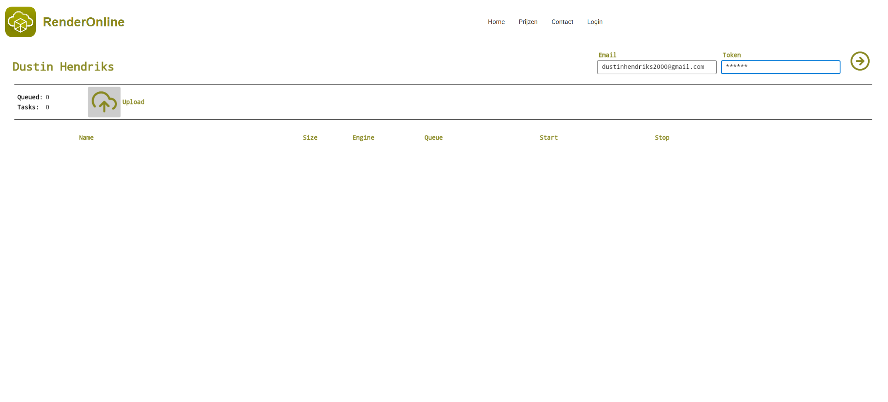

#  RenderOnline

Distributed rendering stack built with .NET, MySQL, Avalonia, and simple HTTP APIs.  
Consists of:

- **HPCServer** – lightweight render worker that runs render engines.
- **RenderAPI** – central queue, orchestration, and REST API.
- **RNOClient** – cross‑platform UI client.
- **Database** – MySQL schema for users, tasks, engines, and queueing.

---

## Showcase



---

## Description

RenderOnline is a small, self‑hosted render farm:

- **Render nodes** run `HPCServer`, which exposes a minimal `/hpc/*` API and wraps CLI render engines (e.g., Blender).
- A central **`RenderAPI`** service authenticates users, manages the queue, assigns tasks to machines, and tracks status in MySQL.
- The **`RNOClient`** GUI (Avalonia, desktop and browser targets) lets users enqueue scenes, monitor progress, download results, and manage tasks.

---

## Highlights

- Multi‑machine render farm (MySQL‑driven scheduler).
- Simple HTTP control plane:
  - `/renderapi/v1/*` for client access.
  - `/hpc/*` for render node control.
- Auth via `email` and `token` headers.
- Subscription‑based queue limits per user.
- Pluggable render engines:
  - Engines defined in DB (`engines` table) and per‑node config (`HPCServer.json`).
  - Arguments templated with `$RENDERONLINE:<argtype>` placeholders.
- Safe argument validation using `argtypes` table and regex/type rules.
- Robust file handling:
  - Upload project file via multipart/form‑data.
  - Engine‑specific working directories per task.
  - On‑demand ZIP packaging of result directories for download.
- Cross‑platform components:
  - HPCServer and RenderAPI run on .NET.
  - RNOClient runs on Windows/Linux/macOS (desktop) and browser (WebAssembly target).

---

## Repository Layout

- `HPCServer/` – render node HTTP server.
- `RenderAPI/` – central API and scheduler.
- `RNOClient/` – Avalonia client:
  - `RNOClient.Desktop/` – desktop entry point.
  - `RNOClient/` – shared app and views (+ browser entry).
- `Database/` – MySQL schema scripts (`renderonline_*.sql`).
- `Readme/` – favicons and screenshots:
  - `favicon_client.png`, `favicon_server.png`, `favicon_api.png`
  - `Client.png`, `Database.png`

---

## Quick Start

### Requirements

- **.NET SDK** 8 (or later).
- **MySQL Server** 8.x.
- OS:
  - HPCServer & RenderAPI: Windows or Linux.
  - RNOClient: Windows/Linux/macOS for desktop; any modern browser for WebAssembly target.
- A CLI render engine installed on each render node (e.g., `blender`, custom renderer, etc.).

---

### 1. Set up the Database

1. Create the `renderonline` database if it does not exist:

   ```sql
   CREATE DATABASE IF NOT EXISTS renderonline;
   ```

2. Import all SQL scripts from `Database/` into `renderonline`:

   ```bash
   mysql -u <user> -p renderonline < Database/renderonline_users.sql
   mysql -u <user> -p renderonline < Database/renderonline_subscriptions.sql
   mysql -u <user> -p renderonline < Database/renderonline_engines.sql
   mysql -u <user> -p renderonline < Database/renderonline_argtypes.sql
   mysql -u <user> -p renderonline < Database/renderonline_machines.sql
   mysql -u <user> -p renderonline < Database/renderonline_renders.sql
   mysql -u <user> -p renderonline < Database/renderonline_tasks.sql
   mysql -u <user> -p renderonline < Database/renderonline_queue.sql
   ```

3. Seed minimal data (adapt values to your environment):

   ```sql
   INSERT INTO subscriptions (subscription_id, name, queue_limit)
   VALUES (1, 'Default', 3);

   INSERT INTO users (first_name, last_name, email, subscription_id, is_active, token)
   VALUES ('Test', 'User', 'user@example.com', 1, 1, 'my-secret-token');

   INSERT INTO engines (engine_id, name, extension, download_path, render_argument)
   VALUES (
     1,
     'blender',
     '.blend',
     '/srv/renderonline/downloads',
     'blender -b $RENDERONLINE:@uploaded_file -s $RENDERONLINE:start_frame -e $RENDERONLINE:end_frame -a'
   );

   INSERT INTO argtypes (argtype_id, type, regex)
   VALUES
     ('start_frame', 'natural', NULL),
     ('end_frame', 'natural', NULL),
     ('output_format', 'extension', NULL);

   INSERT INTO machines (machine_id, ip_address, port)
   VALUES (1, '192.168.1.10', 5001);
   ```

Notes:

- `engines.name` must match `HPCEngine.EngineId` in each `HPCServer.json`.
- `download_path` must be writable by RenderAPI and appropriate for your OS.
- `machines.ip_address` and `port` must point to running HPCServer instances.
- `users.token` is the raw token the client sends in the `token` header.

---

### 2. Configure and Run HPCServer (render node)

Create `HPCServer.json` next to the `HPCServer` executable:

```json
{
  "Port": "5001",
  "RenderingEngines": [
    {
      "EngineId": "blender",
      "ExecutablePath": "/usr/bin/blender"
    }
  ]
}
```

Key points:

- `Port` must match the `machines.port` entry for this node.
- `RenderingEngines[n].EngineId` must exactly match `engines.name` in the DB.
- `ExecutablePath` points to the renderer binary on that machine.

Build and run:

```bash
cd HPCServer
dotnet build
dotnet run
```

The server will listen on `http://0.0.0.0:<Port>` and expose `/hpc/*` endpoints.

---

### 3. Configure and Run RenderAPI (central API)

Create `RenderAPI.json` next to the `RenderAPI` executable.

For HTTP:

```json
{
  "ConnectionString": "Server=localhost;Database=renderonline;User Id=renderonline;Password=yourpassword;",
  "Port": "5000",
  "Certificate": null
}
```

For HTTPS with PEM certificate files:

```json
{
  "ConnectionString": "Server=localhost;Database=renderonline;User Id=renderonline;Password=yourpassword;",
  "Port": "5001",
  "Certificate": {
    "FullchainPemPath": "/etc/ssl/renderonline/fullchain.pem",
    "PrivPemPath": "/etc/ssl/renderonline/privkey.pem"
  }
}
```

Build and run:

```bash
cd RenderAPI
dotnet build
dotnet run
```

RenderAPI will:

- Validate DB connectivity on startup.
- Listen on the configured port (HTTP or HTTPS).
- Start the polling service that assigns queued tasks to machines and monitors completion.

---

### 4. Run the RNOClient

#### Desktop

```bash
cd RNOClient.Desktop
dotnet build
dotnet run
```

By default, `MainView` uses:

- `_ipAddress = "127.0.0.1"`
- `_port = null` → HTTPS to `https://127.0.0.1`

Adjust `_ipAddress` and `_port` in `RNOClient/Views/MainView.axaml.cs` to point to your RenderAPI instance. If you are running RenderAPI over HTTP on port 5000, for example:

- Set `_ipAddress` to your API host.
- Set `_port` to `"5000"` (client then uses `http://<ip>:<port>`).

#### Browser (WebAssembly)

```bash
cd RNOClient
dotnet build
dotnet run
```

This starts the browser‑targeted app (`StartBrowserAppAsync("out")`).  
Refer to Avalonia Browser documentation for static hosting if you want to deploy it.

#### Logging in and Using the Client

1. Enter the email and token you seeded in the `users` table.
2. Click **Validate**:
   - The client calls `GET /renderapi/v1/info`.
   - On success, tasks and user info are loaded and shown.
3. Use **Upload** to enqueue a render:
   - Pick a project file (must match the extension in `engines.extension`, e.g. `.blend`).
   - Set `start_frame` and `end_frame`.
   - Pick an output format (mapped to `output_format` argtype).
4. Monitor tasks:
   - Green check: finished successfully (download available).
   - Busy icon: queued or running.
   - Red error icon: failed.
5. Use the trash icon to delete a task and its data.
6. Use the download icon to save a ZIP archive of the render result.

---

##  HPCServer

### Role

HPCServer runs on each render node and is responsible for:

- Managing at most one render process at a time.
- Starting CLI render engines with provided arguments.
- Tracking process lifetime, status, and exit code.
- Exposing a simple HTTP API for RenderAPI to start/stop tasks and query status.

### Configuration

`HPCServer.json` (see Quick Start) defines:

- `Port`: Kestrel listen port (HTTP only).
- `RenderingEngines`: array of `HPCEngine`:
  - `EngineId`: identifier used by RenderAPI; must match `engines.name` in DB.
  - `ExecutablePath`: full path to renderer binary (e.g., `/usr/bin/blender`).

### HTTP API

Base URL: `http://<ip>:<port>`

#### GET `/hpc/status`

Returns machine status and current task information.

Example response:

```json
{
  "EngineIds": ["blender"],
  "Task": {
    "TaskId": 123,
    "IsSuccess": false,
    "IsRunning": true,
    "TotalSeconds": 42
  }
}
```

- `EngineIds`: the configured engine identifiers from `HPCServer.json`.
- `Task`: null if no task has been started since server start.
- `IsRunning`: true while the process is active.
- `IsSuccess`: last exit code equals 0.

#### POST `/hpc/start`

Starts a new render process if none is currently running.

Request body (`HPCStartArgs`):

```json
{
  "EngineId": "blender",
  "TaskId": 123,
  "Arguments": "blender -b /path/to/file.blend -s 1 -e 100 -a"
}
```

Response (`HPCRenderRequestResponse`):

```json
{
  "IsSuccess": true,
  "Message": "Rendering using engine with identifier: blender"
}
```

Error conditions (HTTP 400):

- A render is already in progress.
- Engine ID not configured.
- Invalid arguments.

#### POST `/hpc/stop`

Stops the currently running render process (if it matches the task ID).

Request body (`HPCStopArgs`):

```json
{
  "TaskId": 123
}
```

Response:

```json
{
  "IsSuccess": true,
  "Message": "Active render terminated!"
}
```

If no active render is running, it still returns HTTP 200 with a message indicating there was no active render.

HPCServer uses `Process.WaitForExitAsync` to determine completion and treats exit code `0` as success.

---

##  RenderAPI

### Role

RenderAPI is the central orchestration service that:

- Authenticates users via headers.
- Exposes all public HTTP endpoints (`/renderapi/v1/*`).
- Manages the render queue and machine inventory in MySQL.
- Assigns tasks to idle HPCServer nodes.
- Polls and updates task states based on HPCServer status.

### Authentication

Each HTTP request from RNOClient (or other clients) must include:

- `email` header: matches `users.email`.
- `token` header: matches `users.token` and `is_active = 1`.

If missing or invalid, endpoints generally return HTTP 401 or a JSON error response.

---

### Public Endpoints

Base URL: e.g. `https://<host>:<port>` (depending on your `RenderAPI.json`).

#### GET `/renderapi/v1/info`

Returns user info and last tasks for the authenticated user.

- Headers: `email`, `token`
- Response (`ApiInfoResponse`):

  ```json
  {
    "User": {
      "UserId": 1,
      "FirstName": "Test",
      "LastName": "User",
      "Email": "user@example.com",
      "SubscriptionId": 1,
      "IsActive": true
    },
    "Tasks": [
      {
        "Task": {
          "TaskId": 123,
          "UserId": 1,
          "QueueTime": "2024-08-27T20:00:00",
          "StartTime": "2024-08-27T20:01:00",
          "EndTime": "2024-08-27T20:05:00",
          "IsRunning": false,
          "IsSuccess": true,
          "RenderId": 5,
          "MachineId": 1
        },
        "Render": {
          "RenderId": 5,
          "FileName": "scene.blend",
          "FilePath": "",
          "FileSize": 12345678,
          "Arguments": "blender -b ...",
          "EngineId": 1
        },
        "Engine": {
          "EngineId": 1,
          "Name": "blender",
          "Extension": ".blend",
          "DownloadPath": "/srv/renderonline/downloads",
          "RenderArgument": "blender -b ..."
        }
      }
    ]
  }
  ```

Only the last 15 tasks per user are returned, ordered by `task_id` descending.

---

#### POST `/renderapi/v1/enqueue`

Enqueues a new render task.

- Headers: `email`, `token`
- Content type: `multipart/form-data`
- Parts:
  - **`request`** – JSON `ApiEnqueueRequest`:
    ```json
    {
      "EngineId": "1",
      "Arguments": [
        { "ArgTypeId": "start_frame", "Value": "1" },
        { "ArgTypeId": "end_frame", "Value": "100" },
        { "ArgTypeId": "output_format", "Value": ".png" }
      ]
    }
    ```
  - **File** – a single project file (e.g., `.blend`).

Validation performed:

- User’s `subscription.queue_limit` vs current queued tasks for that user.
- Engine existence and `extension` matching the file extension.
- Each argument’s `ArgTypeId` must exist in `argtypes`.
- Value checked either with:
  - Built‑in regex for `argtypes.type` (`file`, `path`, `extension`, `word`, `sentence`, `natural`, `integer`, `real`), **or**
  - Custom `argtypes.regex` if provided.

Argument expansion:

- Starts from `engines.render_argument`.
- Replaces `$RENDERONLINE:<ArgTypeId>` with provided values.
- Replaces `$RENDERONLINE:@uploaded_file` with the saved file path.

Persistence:

- Saves uploaded file under `engines.download_path/<user_id>/<queue_time_ticks>/`.
- Inserts row in `renders`.
- Inserts row in `tasks` with `queue_time`, `is_running = 0`, `is_success = 0`.
- Inserts row in `queue` with `task_id`.

Response (`ApiEnqueueResponse`):

```json
{
  "IsAdded": true,
  "ErrorMessage": "Task successfully enqueued."
}
```

On validation errors, returns appropriate HTTP 4xx and `IsAdded = false` with details.

---

#### POST `/renderapi/v1/dequeue`

Removes a queued task from the queue (and optionally stops it on the machine).

- Headers: `email`, `token`
- Content type: `application/json`
- Body (`ApiDequeueRequest`):

  ```json
  {
    "TaskId": 123
  }
  ```

Flow:

1. Validate task ownership (`tasks.user_id == current user`).
2. Confirm the task is present in `queue`.
3. Delete the row from `queue`.
4. Load the full task (joins `tasks`, `renders`, `engines`).
5. If `tasks.machine_id` is not null:
   - Lookup machine IP and port in `machines`.
   - Call `POST /hpc/stop` on that machine with matching `TaskId`.

Response (`ApiDequeueResponse`):

```json
{
  "IsRemoved": true,
  "ErrorMessage": "Task successfully dequeued."
}
```

---

#### POST `/renderapi/v1/download`

Downloads a ZIP archive of the render output directory.

- Headers: `email`, `token`
- Content type: `application/json`
- Body (`ApiDownloadRequest`):

  ```json
  {
    "TaskId": 123
  }
  ```

Flow:

1. Validate task ownership.
2. Retrieve `renders.file_path` for that task.
3. Compute parent directory of `file_path`.
4. Create a temporary ZIP using `ZipFile.CreateFromDirectory`.
5. Stream the ZIP with headers:
   - `Content-Type: application/zip`
   - `Content-Disposition: attachment; filename=<guid>.zip`
6. Attempt to delete the temporary ZIP after sending.

On success, binary ZIP is returned. On failure, JSON `ApiDownloadResponse` is returned with `DownloadProvided = false`.

---

#### POST `/renderapi/v1/delete`

Fully deletes a task and its associated render.

- Headers: `email`, `token`
- Content type: `application/json`
- Body (`ApiDeleteRequest`):

  ```json
  {
    "TaskId": 123
  }
  ```

Flow:

1. Validate task belongs to current user.
2. Resolve `render_id` and `file_path` via join on `tasks` and `renders`.
3. Remove from `queue` (if present).
4. Delete the directory that contains `file_path` (with retries).
5. Delete the row from `tasks`.
6. Delete the row from `renders`.

Response (`ApiDeleteResponse`):

```json
{
  "IsDeleted": true,
  "ErrorMessage": "Task and associated render successfully deleted."
}
```

---

### Scheduler / Polling Loop

`StartPollingService()` runs an infinite background loop:

- Every 15 seconds:

  1. Query all tasks that:
     - Are in `queue` (via join).
     - Have `is_success = 0`.
  2. For each `ApiTaskInfo`:

     - If `task.MachineId == null` and `task.IsRunning == false`:
       - Call `AssignTaskToMachine(task)`:
         - Enumerates machines from `machines`.
         - For each, calls `GET http://<ip>:<port>/hpc/status`.
         - If machine idle (no running task), calls `POST /hpc/start` with:
           - `EngineId` = `engine.Name` (matches HPCServer engine ID).
           - `Arguments` = `render.Arguments`.
         - On success, calls `UpdateTaskStartDetails(taskId, machineId)` (sets `start_time`, `is_running`, `machine_id`).
     - Else:
       - Call `CheckTaskStatusOnMachine(task.Task)`:
         - Finds machine by `task.MachineId`.
         - Calls `/hpc/status`.
         - If `status.Task` present:
           - If not running and success: `CompleteTask(taskId)`:
             - Sets `end_time`, `is_running = 0`, `is_success = 1`, removes from `queue`.
           - If not running and failure: `HandleTaskFailure(taskId, machineId)`:
             - Sets `start_time/end_time` to now, `is_running = 0`, `is_success = 0`, removes from `queue`.

This design keeps HPCServer mostly stateless, with RenderAPI and the database being the source of truth.

---

##  RNOClient

### Role

RNOClient is a thin UI client for RenderAPI:

- Shows authenticated user info and last tasks.
- Visualizes states: queued, running, success, failure.
- Provides an upload dialog for enqueueing tasks.
- Wraps delete and download flows with confirmation and OS file pickers.

### Key Components

- `MainView.axaml.cs`
  - Handles:
    - Login (email/token headers).
    - `GET /renderapi/v1/info`.
    - Delete, download, and enqueue triggers.
- `UploadView.axaml.cs`
  - Provides file picker and argument fields (`start_frame`, `end_frame`, `output_format`).
- `TaskView.axaml.cs`
  - Visual representation of each `ApiTaskInfo` with icons and action buttons.
- `ITaskListener` / `IUIInfluencer`
  - Interfaces for wiring views to actions and navigation.

### Typical Flow

1. User enters email and token, presses **Validate**.
2. `RenderAPIInfoRequest` loads tasks and shows them in `TasksPanel`.
3. Clicking **Upload** shows `UploadView`:
   - `Browse` selects project file.
   - User sets frame range and format.
   - Enqueue sends `ApiEnqueueRequest` + file via multipart/form‑data.
4. After enqueue or delete, `RenderAPIInfoRequest` refreshes the task list.
5. Download uses `SaveFileUsingStorageProvider` to store ZIP from `RenderAPI`.

---

## Database


The database scripts in `Database/` (`renderonline_*.sql`) create the following schema:

- **`users`**
  - `user_id`, `first_name`, `last_name`, `email`
  - `subscription_id` (FK conceptually to `subscriptions`)
  - `is_active`
  - `token` (used verbatim as API token)
- **`subscriptions`**
  - `subscription_id`, `name`, `queue_limit`
  - Controls maximum number of queued tasks per user.
- **`engines`**
  - `engine_id`, `name`, `extension`, `download_path`, `render_argument`
  - `name` is referenced by HPCServer (`EngineId`).
  - `extension` is used to validate upload file type.
  - `download_path` is the root directory for per‑task folders.
  - `render_argument` is a template string with `$RENDERONLINE:...` placeholders.
- **`argtypes`**
  - `argtype_id`, `type`, `regex`
  - Defines allowed argument types for templating:
    - Supported `type` values: `file`, `path`, `extension`, `word`, `sentence`, `natural`, `integer`, `real`.
    - If `regex` is null, RenderAPI uses built‑in regex for the given `type`.
- **`machines`**
  - `machine_id`, `ip_address`, `port`
  - Describes available HPCServer nodes; `ip_address` and `port` must match node configuration.
- **`renders`**
  - `render_id`, `file_name`, `file_path`, `file_size`, `arguments`, `engine_id`
  - Stores uploaded file metadata and fully expanded render arguments.
- **`tasks`**
  - `task_id`, `user_id`, `queue_time`, `start_time`, `end_time`
  - `is_running`, `is_success`
  - `render_id`, `machine_id`
  - Represents individual render jobs.
- **`queue`**
  - `queue_id`, `task_id`
  - Presence in this table means the task is queued; scheduler logic removes entries on completion, failure, or dequeue.

The SQL scripts do not declare foreign keys but the logical relationships are as described above.

---

## Development Notes

- Projects are plain .NET applications:
  - HPCServer and RenderAPI use ASP.NET Core minimal hosting with manual route mapping (`MapGet`, `MapPost`).
  - RNOClient uses Avalonia for the cross‑platform UI.
- Logging is currently console‑based.
- JSON serialization uses Newtonsoft.Json (`JsonConvert`).
- Render execution is delegated to external processes via `System.Diagnostics.Process`.

To build all components:

```bash
dotnet build HPCServer
dotnet build RenderAPI
dotnet build RNOClient.Desktop
dotnet build RNOClient
```

---

## Roadmap (Ideas)

- More advanced scheduling:
  - Priorities, retries, backoff, and machine load awareness.
- Multi‑engine and multi‑output support per task.
- Per‑task logs and stdout/stderr streaming.
- Web (HTML) client alternative to the Avalonia application.
- Stronger authentication and user/role management APIs.
- Optional metrics and monitoring endpoints.

---

## Contributing

Contributions are welcome.

- Open issues for bugs or feature requests.
- Submit PRs focused on a single area (HPCServer, RenderAPI, RNOClient, or Database).
- Please keep code style consistent with the existing C#.

---

## License

See `LICENSE`.